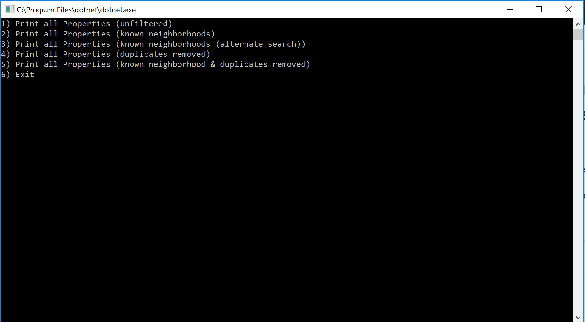

# CODE 8: LINQ

------------------------------

# LINQ in Manhattan
#### Lab08-LINQ in Manhattan
##### *Author: Mike Kelly*

------------------------------

## Description
#### This C# program is a program that brings in data from an external file(data.json), reads the data, and can filter the data based on specified values.
------------------------------

## Getting Started
Clone this repository to your local machine.
```
$ git clone [https://github.com/Michael-S-Kelly/Lab08-LINQ_In_Manhattan.git]
```
#### To run the program from Visual Studio:
Select ```File``` -> ```Open``` -> ```Project/Solution```

Next navigate to the location you cloned the Repository.

Double click on the ```LINQInManhattan``` directory.

Then select and open ```LINQInManhattan.sln```

------------------------------

## Visuals


##### Application Start



------------------------------

## Change Log


------------------------------
## Collaborators, Contributors, and Other Resources used

### Collaborators

### Contributors


### Other Resources
#### Microsoft Visual C# Step by Step Ninth Edition
#### C# 7.0 in a Nutshell
#### C# Pocket Reference
#### C# and .NET Core Test-Driven Development

------------------------------
For more information on Markdown: https://www.markdownguide.org/cheat-sheet